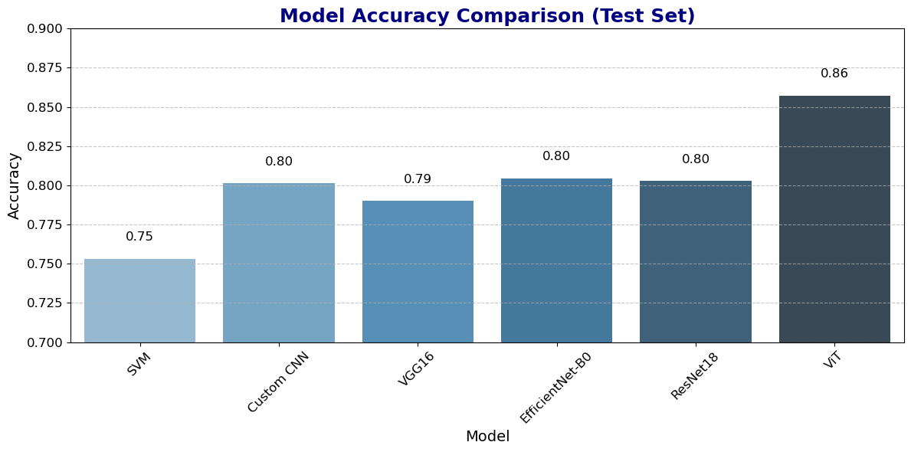
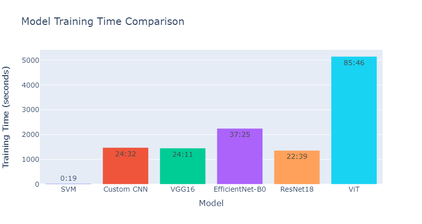

# Pneumonia Classifier

* This pneumonia classifier application takes a chest X-ray image as input and classifies it as either `pneumonia` or `normal`. 
* The frontend of the application is created with the Python open-source library **Streamlit**. 
* For classification, we use **Resnet18**, a deep learning model known for image recognition tasks, which has an accuracy of 80% on our test dataset. 
* We selected this model after experimenting with conventional machine learning model, custom cnn architecture, vision transformer pretrained model, and various deep learning pretrained models.
* We achieved the highest accuracy of 86% with the Vision Transformer (ViT), but we selected Resnet18 to balance performance and complexity, Resnet18 is generally faster and more lightweight compared to ViT.

* The application is deployed to Hugging Face Spaces and is now live. You can access it here: [Pneumonia Classifier](https://huggingface.co/spaces/imran-nawar/pneumonia-classifier)

<p align="center">
  
</p>


## Dataset Overview  
* The dataset used are [Chest X-Ray Images (Pneumonia)](https://www.kaggle.com/datasets/paultimothymooney/chest-xray-pneumonia/data).
* It have total **5,863** X-Ray images (JPEG).
* The dataset is organized into three main folders: `train`, `val` and `test`.
* The dataset consist of two categories:
    1. `PNEUMONIA`: 3875 images
    2. `NORMAL`:  1341 images


---
<div style="display: flex; justify-content: space-between;">
  <div style="flex: 1;">
  
  ### Models Accuracy Table

  | Model                              | Accuracy (%)|
  |------------------------------------|-------------|
  | Conventional Machine Learning (SVM)| 0.75        |
  | Custom CNN                         | 0.80        |
  | VGG16                              | 0.79        |
  | EfficientNet-B0                    | 0.80        |
  | Resnet18                           | `0.80`      |
  | ViT                                | **0.86**    |

  </div>
  <div style="flex: 1; text-align: center;">
  
  ### Models Accuracy Comparison
  
  <!--  -->
  

  </div>
</div>

---

### Models Training Time Comparison
<p align="center">
  
</p>

---

### Confusion Matrices of Models
<p align="center">
  
</p>


## 🚀 Quick Start

1. **Clone the Repository**:
    ```sh
    git clone https://github.com/ImranNawar/pneumonia-classifier.git
    ```
2. **Navigate to the Directory**:
    ```sh
    cd pneumonia-classifier
    ```
3. **Install Dependencies**:
    ```sh
    pip install requirements.txt
    ```
4. **Train the Models**:
   * Open the notebook `pneumonia-classifer.ipynb`
   * Run all the cells to train all the models or just specific cells, if you want to train or finetune a specific model.

5. **Run the Application**:
    ```sh
    cd src
    streamlit run main.py
    ```

## 📁 Project Structure

```bash
pneumonia-classifier/
├── content/
│   ├── plots/
│   ├── app_interface.png
│   └── background.jpg
├── data/                               # ignored in .gitignore
│   ├── test/
│   │   ├── NORMAL/
│   │   └── PNEUMONIA/
│   ├── train/
│   │   ├── NORMAL/
│   │   └── PNEUMONIA/
│   └── val/
│       ├── NORMAL/
│       └── PNEUMONIA/
├── model/
│   ├── label.txt
│   └── resnet18.pth                     # ignored in .gitignore
├── src/
│   ├── main.py
│   └── util.py
├── training/
│   └── pneumonia-classifier.ipynb
├── .gitignore
├── LICENSE
├── README.md
└── requirements.txt
```

## 📄 License
This project is licensed under the [MIT License](LICENSE).